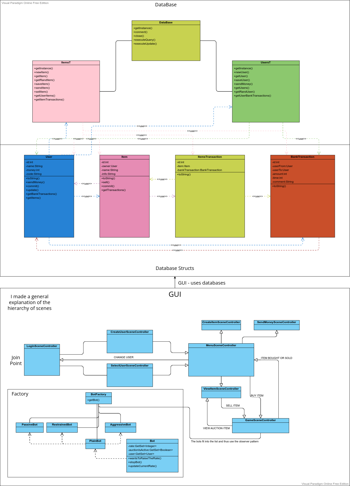

# EAUKC

#### Author: [Illia Chaban](https://github.com/ic-it)
#
## About project
The goal of the project is to create an implementation for an electronic auction of the "English auction" type. The project is based on the principle of interaction with the database and the use of GUI. When entering, the user is presented with the selection of a file with the database, and then the creation or selection of a player from the database. In the next stage you get to the scene with the personal cabinet. You can choose your item and put it up for sale or join other people's auctions. All transfers of money or items are documented. Each transfer of an item has a receipt assigned to it.

## Javadoc
A fully compiled Javadoc can be found at [Javadoc/](Javadoc/)

## Struct
    ./lib/     # libraries
    ./src/     # source code
    ./Javadoc/ # compiled Javadoc

## Class Tree

## Build and use
### DB
Before using - create a database or select an existing one.
### Build
The project contains all the libraries for the correct operation of the program. The build can be done in VS Code as well as in Eclipse or IntelliJ IDE.
File with the main function: GUI.java

## Moje hodnotenie vykonanej práce
Myslím, že som splnil hlavné kritériá na dobrej úrovni. 
Tu je zoznam ďalších kritérií, ktoré som tiež splnil:
- použitie návrhových vzorov okrem návrhového vzoru Singleton – každý implementovaný návrhový vzor sa počíta ako splnenie jedného ďalšieho kritériá, ale implementácia všetkých návrhových vzorov sa posudzuje maximálne na úrovni splnenia troch ďalších kritérií:
  - ✔ Used Factory and Observer
- ošetrenie mimoriadnych stavov prostredníctvom vlastných výnimiek – stačí jedna vlastná výnimka, ale musí byť skutočne vyhadzovaná a ošetrovaná:
  - ✔ `src/game/BotFactory.java`
- poskytnutie grafického používateľského rozhrania oddelene od aplikačnej logiky a s aspoň časťou spracovateľov udalostí (handlers) vytvorenou manuálne – počíta sa ako splnenie dvoch ďalších kritérií:
  - ✔ ``
- explicitné použitie viacniťovosti (multithreading) – spustenie vlastnej nite priamo alebo prostredníctvom API vyššej úrovne (trieda Task a pod.):
  - ✔ `src/GUIScenes/GamseSceneController.java`
- použitie generickosti vo vlastných triedach – implementácia a použitie vlastnej generickej triedy (ako v príklade spájaného zoznamu poskytnutého k prednáške 5):
  - ✔ `src/utils/GetSet.java` @done(22-04-26 15:33)
- explicitné použitie RTTI – napr. na zistenie typu objektu alebo vytvorenie objektu príslušného typu (ako v hre s obrami a rytiermi pri zisťovaní počtu bytostí):
  - ✔ ``
- použitie vhniezdených tried a rozhraní – počíta sa iba použitie v aplikačnej logike, nie v GUI, pričom rozhrania musia byť vlastné (jedna možnosť je v príklade vnútorných tried k prednáške 4):
  - ✔ `src/game/BotFactory.java`
- použitie lambda výrazov alebo referencií na metódy (method references) – počíta sa iba použitie v aplikačnej logike, nie v GUI (jedna možnosť je v príklade referencií na metódy a lambda výrazov k prednáške 4):
  - ✔ `src/db/DataBase.java` @done(22-04-26 15:43)
- použitie implicitnej implementácie metód v rozhraniach (default method implementation):
  - ✔ `src/db/IItensT.java`
- použitie aspektovo-orientovaného programovania (AspectJ):
  - ✘ Not done @cancelled(22-05-10 22:45)
- použitie serializácie:
  - ✔ `src/db/DataBase.java` @done(22-04-26 15:43)

## :warning: Important information. :warning:
- If the program hangs when starting a game scene - restart it. This happens because of javafx (Task) problems. 
- If you can't create users - you didn't select the database correctly
- While writing the program, I had a problem related to incompatibility of commits. I could not solve it, so all the commits were erased. 
Therefore, only the current version and the first version are important.
